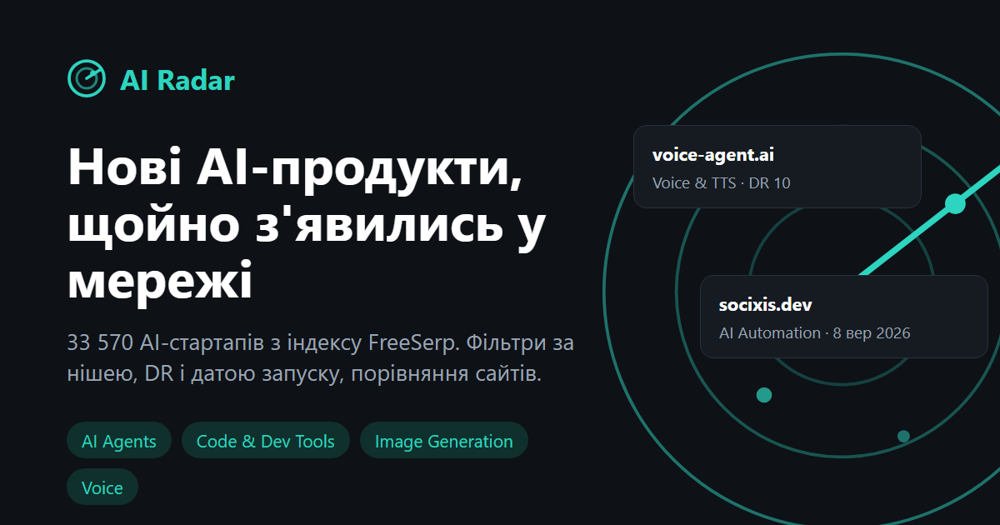

# AI Radar

Каталог нових AI-продуктів на основі публічного API [FreeSerp](https://freeserp.ai/docs.php)
(індекс `sites`: головні сторінки сайтів, ніша AI). Тестове завдання на вакансію
Junior AI Web Developer у Semalt.

**Демо:** https://ai-radar-eight-tan.vercel.app
**План сайту:** [PLAN.md](PLAN.md) (мета, аудиторія, сторінки, структура, рішення)



## Що зроблено

| Сторінка | Що вміє |
|---|---|
| **Огляд** `#/` | Цифри індексу з `stats=1`, 18 ніш з кількістю сайтів, найновіші продукти, найавторитетніші нові (найвищий DR серед запущених за 30 днів) |
| **Каталог** `#/catalog` | Пошук, фільтри: ніша, стек/конструктор (Lovable, v0, Next.js...), DR від, дата запуску (7/14/30 днів), сортування; пагінація по 24. Стан фільтрів в URL, будь-яку вибірку можна переслати посиланням |
| **Профіль сайту** `#/site/<домен>` | LLM-опис, усі поля з індексу, посилання на сайт, 6 схожих сайтів тієї ж ніші за DR |
| **Порівняння** `#/compare?d=a.ai,b.com` | До 4 сайтів у таблиці, найвищий DR підсвічено, посилання на порівняння копіюється однією кнопкою |
| **Про проєкт** `#/about` | План сайту і що варто знати про дані |

Також:
- **Фільтр шуму.** За замовчуванням `ai_startups=1`: без магазинів, каталогів і казино, які просто
  згадують AI. Галочкою можна показати все (`category=ai`).
- **Фільтр 18+.** У нішах генерації зображень багато NSFW-сайтів («undress», «nude»), а прапорця
  для них в API немає. Вони приховуються на клієнті за словником, сайт пише, скільки приховано;
  галочкою можна показати.
- **Безпека.** Заголовки й описи взяті з чужих сайтів, тому все з API екранується перед вставкою
  в HTML, посилання тільки `http(s)` з `rel="noopener noreferrer nofollow"`.
- **Обережність з API.** Кеш відповідей (пам'ять і `sessionStorage`, 10 хв) плюс CDN-кеш проксі
  5 хв, скасування застарілих запитів, таймаут 15 с, не більше 3 спроб.
- Мобільна версія, темна тема за системними налаштуваннями, доступність (skip-link, `aria-live`,
  підписи полів), без фреймворків і веб-шрифтів.

## Стек

HTML, CSS, JavaScript (ES-модулі), без збірки і залежностей. Одна serverless-функція Vercel
(`api/freeserp.js`) як проксі до API. Тести на вбудованому `node:test`.

```
index.html          каркас і сторінка «Про проєкт»
css/style.css       стилі
js/app.js           роутер і сторінки
js/api.js           клієнт API: кеш, таймаут, повтори
js/util.js          чисті функції: екранування, фільтри, стан URL (покриті тестами)
lib/proxy.js        проксі з білим списком параметрів
api/freeserp.js     той самий проксі як функція Vercel
dev-server.mjs      локальний сервер: статика + проксі
tests/              14 тестів
```

## Як запустити

Потрібен Node.js 20+.

```bash
git clone https://github.com/LeonidShamarin/ai-radar.git
cd ai-radar
npm run dev        # http://localhost:8765
npm test           # 14 тестів
```

Деплой: імпорт репозиторію у Vercel, без налаштувань (Framework Preset: Other).

## Що з'ясувалось про API (і як це враховано)

1. **CORS з браузера не працює, хоча документація каже «CORS-open».** FreeSerp віддає
   заголовок `access-control-allow-origin: *` двічі, а браузер дубль відхиляє:
   `fetch` падає з `Failed to fetch`. Перевірив так: запит з `mode: 'no-cors'` доходить, а звичайний
   ні, і `curl -D -` показує два однакові заголовки. Тому запити йдуть через власний проксі на тому
   ж домені. Це не відкритий проксі: адреса фіксована, параметри з білого списку з обмеженням
   довжини. Якщо проксі немає (статичний хостинг), клієнт один раз перемикається на пряме звернення,
   і воно запрацює, щойно FreeSerp виправить заголовок.
2. **Індекс AI-стартапів відстає.** Найсвіжіша дата `went_live` у ніші AI 8 вересня 2026, хоча
   сьогодні 2 жовтня. Фільтр «за 7 днів» від сьогоднішньої дати завжди був би порожнім, тому він
   рахується від найсвіжішої дати в даних, і сайт це пише прямо.
3. **Фільтр `domain=` API мовчки ігнорує** (на `domain=cursor.com` повертає google.com). Профіль
   шукає через `q=<домен>` і бере лише точний збіг; якщо сайту немає в індексі, так і пише.
4. **`dr` у нових доменів часто `null`.** Показується «н/д», а не 0, і в порівнянні такий сайт
   не вважається гіршим.
5. **`ai_source` іноді містить сирий мета-тег генератора** (`gen:wpml ver4.9.6 ...`): показується
   як «Інший».
6. Список ніш і конструкторів не захардкожений, його дає `stats=1`.

## Як я працював з AI

Інструмент: Claude Code (агент Claude від Anthropic). Порядок роботи:

1. **Спершу дані, потім код.** До першого рядка коду AI прочитав документацію і зробив реальні
   запити: CORS-заголовки, кожен фільтр, який буде в інтерфейсі, пошук за доменом, формат `stats`.
   Звідси пункти 2-4 вище, і вони потрапили в план до початку розробки.
2. **План як окремий артефакт** ([PLAN.md](PLAN.md)): сторінки, які запити до API на кожній,
   технічні рішення. Код писався під план.
3. **Перевірка, а не довіра.** Що знайшлося на перевірках:
   - на рев'ю власного коду до запуску: змінна `window` затіняла глобальний об'єкт; при додаванні
     сайту в порівняння роутер спрацьовував двічі; вибране «Спершу нові» губилося, коли в пошуку
     був текст (дефолтне сортування залежить від запиту). Останнє закрите тестом;
   - у браузері: API недоступне через дубльований CORS-заголовок (пункт 1), хоча `curl` працював.
     Без запуску в браузері це б не знайшлося;
   - на скріншотах: NSFW-сайти на першому екрані ніші Image Generation, сирі значення стеку,
     зайвий відступ у меню (атрибут `hidden` перебивався CSS);
   - хибна тривога теж перевірена: на «мобільному» скріншоті здавалось, що є горизонтальний скрол,
     а насправді headless Chrome не робить вікно вужчим за 500 px. Перевірив сторінку в iframe
     шириною 390 px: скролу немає.
4. **Тести** на чисті функції (екранування, розбір URL, фільтри, проксі, 18+): 14 штук, запускались
   у Docker з лімітом пам'яті.

## Що не встиг

- **SEO для сторінок каталогу.** Хеш-роутинг зручний для статичного хостингу, але пошуковики не
  індексують `#/site/...`. Для реального проєкту потрібні звичайні URL і пререндер.
- **Фільтр 18+ словниковий:** він ловить очевидне, але не все.
- **Наскрізних тестів** (Playwright) немає, інтерфейс перевірено вручну і скриншотами.
- Іконки сайтів беруться з DuckDuckGo; для частини доменів там сіра заглушка.

## Що доробив би далі

1. Окремі сторінки для кожної ніші і кожного сайту з нормальними URL і пререндером (`/niche/image-generation`),
   `sitemap.xml`: це дає органічний трафік на довгі запити «AI tools for X».
2. Щотижневий дайджест «нові в ніші» (RSS або email), бо головна цінність тут у свіжості.
3. Пошук по всьому вебу (`index=web`) на сторінці сайту: згадки продукту, відгуки, огляди.
4. Графік появи нових AI-продуктів за днями з `stats.by_day`.
5. Повідомити FreeSerp про дубльований CORS-заголовок; після виправлення проксі стане не потрібним.
